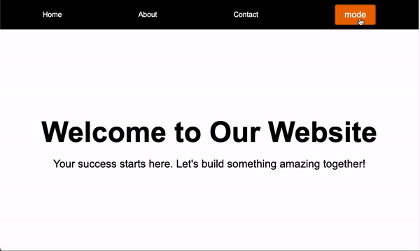

# 🎨 Ejercicio: Modo de Color con Manipulación del DOM en JavaScript

## 🎯 Objetivo

Manipular los colores de los elementos de un archivo HTML utilizando JavaScript al hacer clic en el botón "mode".

## 📝 Instrucciones:

Queremos que al hacer clic en el botón "mode" se produzcan los siguientes cambios en el diseño de la página:

1. Cambiar el color del **navbar** a un color claro.
2. Cambiar el color de fondo del **hero** a un color oscuro.
3. Cambiar el color de **todos los textos** del navbar a **negro**.
4. Cambiar el color de **todos los textos** del hero a **blanco**.

### 📄 Archivos necesarios:

Para completar este ejercicio, necesitarás:

- Un archivo HTML: `index.html`.
- Un archivo de JavaScript: `script.js` para manipular el DOM y realizar los cambios de estilo.
- Opcionalmente, un archivo CSS: `style.css` para agregar cualquier estilo adicional.

## ✅ Requisitos:

- Implementa la funcionalidad utilizando **JavaScript** para escuchar el evento del botón "mode" y cambiar los colores en consecuencia.
- Asegúrate de que los cambios afecten solo a los elementos especificados (navbar, hero, y los textos correspondientes).

Este ejercicio te ayudará a practicar la manipulación del DOM con JavaScript, aplicando cambios en los estilos dinámicamente según interacciones del usuario.

### 🖼️ Ejemplo de referencia:

